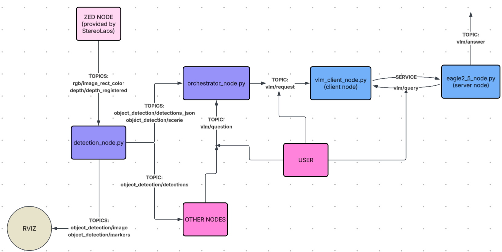
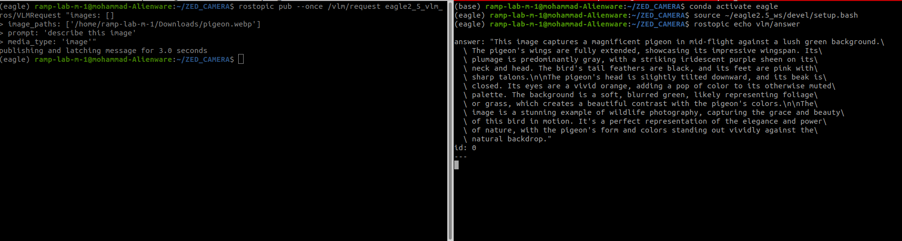

# UAM-GUI-APP-ALBUM
This repo exists to show my work while the source is still private. It documents a
VLM-powered vision pipeline I built over summer 2026 at SFU's RAMP Lab.
[Here](github.com) is a video demo of the full stack system. 

## What it is
A ROS 1 pipeline that turns a stereo camera feed into something you can ask questions
about in natural language. A ZED camera streams RGB and depth, a detection node
produces structured object detections, and an orchestrator packages those detections
into context for a vision-language model. You type a question, the VLM answers it
grounded in what the robot is actually looking at.

### perception pipline:

The design goal was modularity: perception, orchestration, and inference
are independent nodes that talk over topics and services, so the VLM backend can be
swapped without touching the detection stack.

## Components
Let us dive into each component of the pipeline.

### Eagle Wrapper Node 

The first component is the Eagle 2.5 VLM wrapper. Eagle 2.5 is NVIDIA's vision-language
model family built for embodied AI, so it handles multi-image and spatial reasoning
better than a general-purpose captioning model.

The wrapper is split into two scripts:

**`eagle2_5_node.py`** (server) -- loads the model weights into GPU memory once at
startup and advertises the `vlm/query` service. Loading takes several seconds, which is
the whole reason this is a persistent node rather than a subprocess spawned per query.
On each request the node parses the incoming fields, runs inference, returns the answer
string to the caller, and publishes the same result on `vlm/answer` for any other node
that wants to listen.

**`vlm_client_node.py`** (client) -- subscribes to `vlm/request`, packs the message into
a `vlm/query` service request, and calls the server. 

**vlm/query custom message**
| Field | Type | Purpose |
|---|---|---|
| `images` | `sensor_msgs/Image[]` | Frames passed inline, typically straight off the ZED |
| `image_paths` | `string[]` | Alternative to `images`, loads from disk instead |
| `prompt` | `string` | The assembled prompt from the orchestrator |
| `media_type` | `string` | Selects the input mode: `[text/image/multi_image/video]` |
| `id` | `uint32` | Correlates a response with its request (optional) |

#### Architectural decisions

**`vlm/answer` is published by the server, not the client.** Requests can arrive two ways:
via the `vlm/request` topic, or by calling `vlm/query` directly. Publishing from the server
means `vlm/answer` catches both. Publishing from the client would miss direct service calls.

**The blocking call lives in its own node.** ROS 1 service calls are synchronous, and VLM
inference takes multiple seconds. Confining that call to `vlm_client_node.py` means only it stalls
`detection_node.py` and `orchestrator_node.py` are separate processes and keep spinning.

