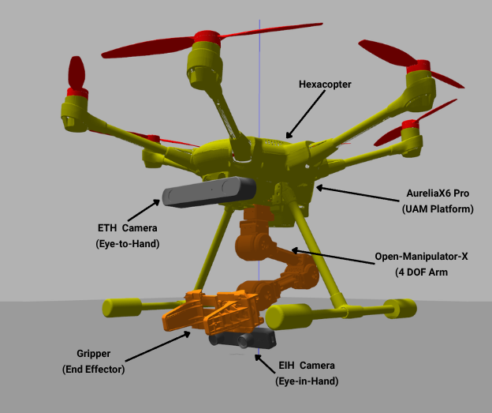
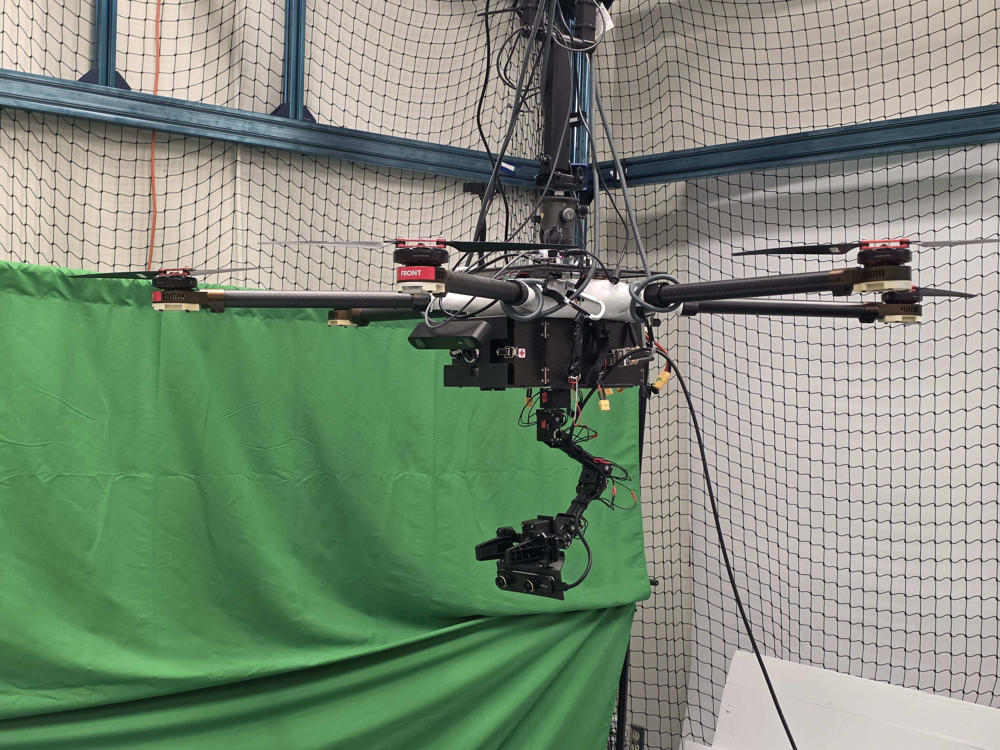
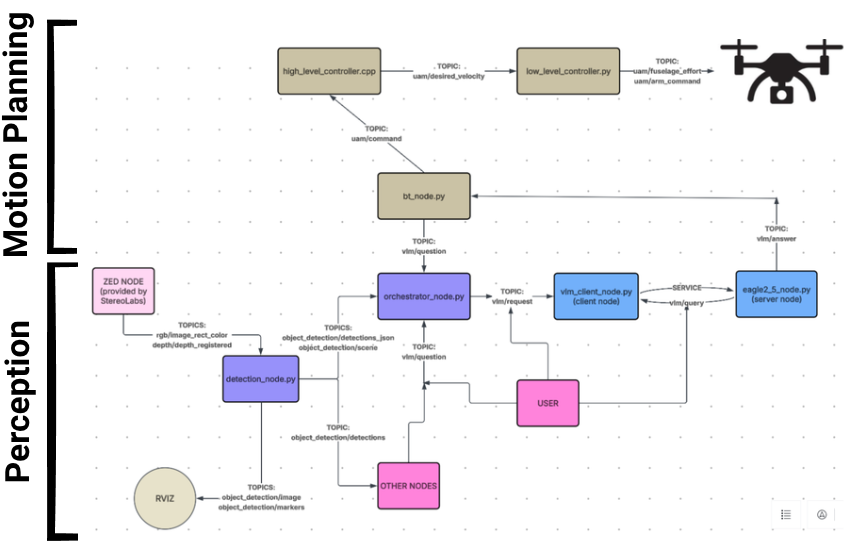
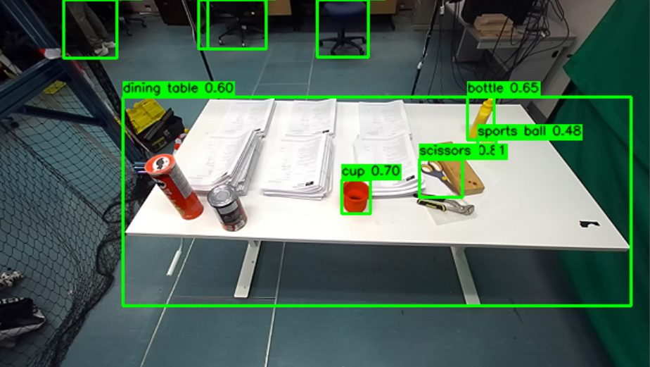
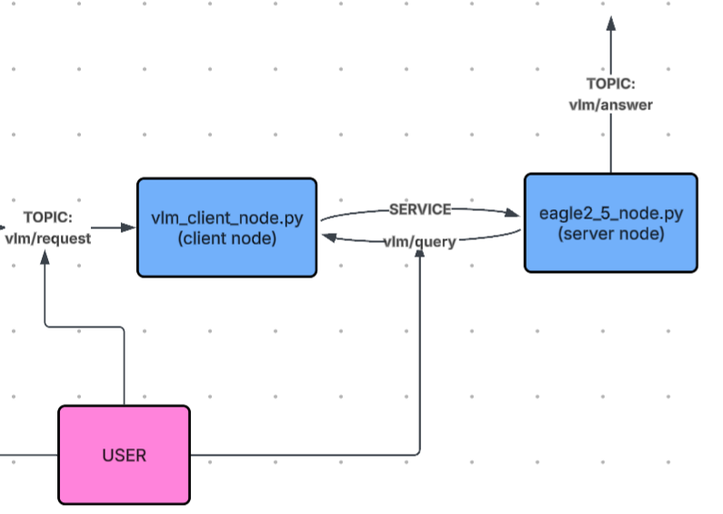
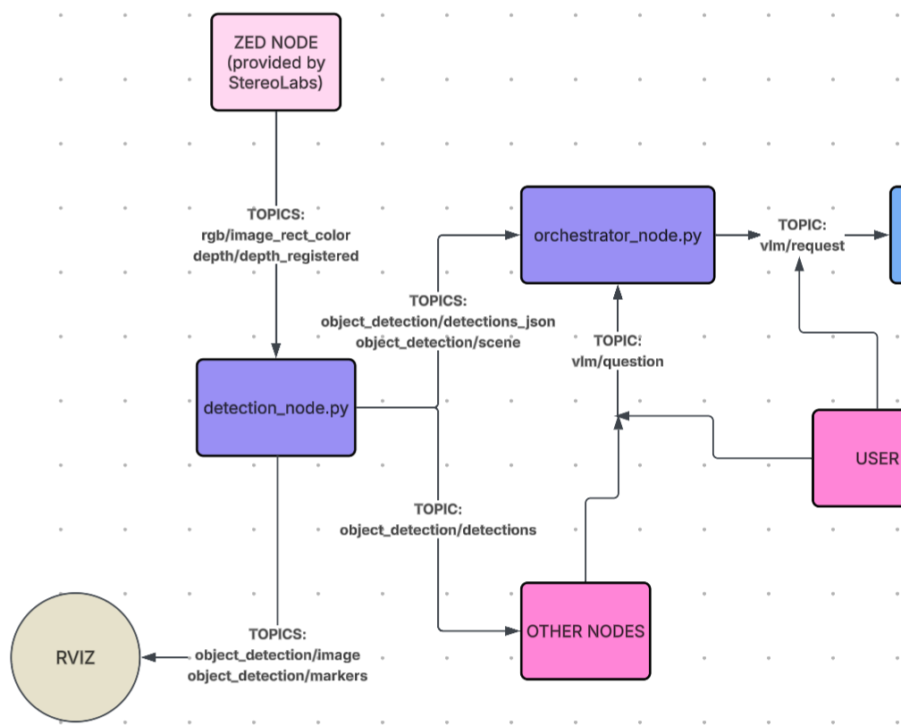
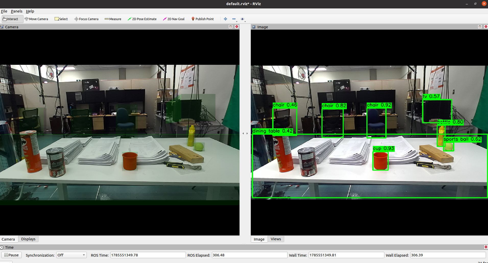
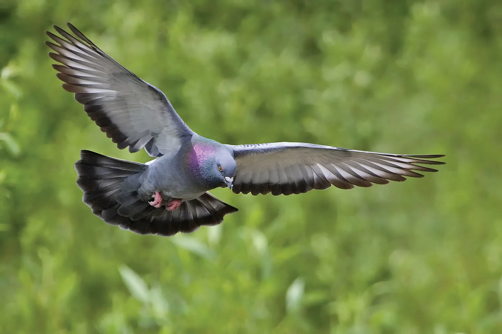

# VLM-Augmented Behavior Trees for Autonomous Aerial Object Retrieval under Semantic Uncertainty

*RAMP Lab, Simon Fraser University · Summer 2026*

At SFU's [RAMP Lab](https://www.ramplab.ca/), I've been building the new perception and motion planning stack for aerial object retrieval, powered by StereoLab's ZED cameras, NVIDIA's Eagle 2.5 VLM,Ultralytics' YOLO26x. Most recently I've been wrapping all of it into a GUI app, so the same interface drives the system in simulation and on real hardware.

The source is still private, so this repo is the album.

<!-- ASSET 1: the hook. 15-25s looping GIF of the GUI driving a full retrieval.
     You have full-stack demo footage -- cut the tightest window where the
     operator does something and the drone responds. GIF, not a video link.
     Nobody clicks the link. -->


[Full video demo →](github.com)

---

## The platform

<!-- ASSET 2: the real hardware photo, not Gazebo. Gazebo moves to the sim
     section. If the arm and both cameras are visible, add labelled arrows
     matching the table. -->
<!-- ASSET 3: you have this one. ETH and EIH views of the same instant,
     side by side. Makes the distinction obvious in one glance. -->
<table>
<tr>
<td></td>
<td></td>
</tr>
</table>

- **AureliaX6 Pro (UAM Platform)** -- hexacopter airframe that carries the rest of the system
- **Open-Manipulator-X (4 DOF Arm)** -- robotic arm mounted underneath the hexacopter
- **Gripper (End Effector)** -- two-fingered gripper at the end of the arm
- **ETH Camera (Eye-to-Hand)** -- fixed camera on the body, viewing the arm/workspace from outside
- **EIH Camera (Eye-in-Hand)** -- camera mounted directly under gripper, co-moving with it for closed-loop manipulation

---


<!-- ASSET 4: one diagram showing all four layers stacked, with the arrows
     between them. This is the load-bearing figure of the whole README --
     it is the map a reader keeps coming back to. Worth an hour in draw.io.
     concept_map.png currently only covers the perception layer. -->

## Three layers

**Perception.** ZED stereo feeds YOLO26x, whose 2D bounding boxes get lifted into 3D against the registered depth map, and the result is packaged as scene context that a VLM can answer questions about.

**Motion planning.** Behavior tree communicates with the perception stack and issues commands to the high-level controller, originally authored by [Mohammad Soltanshah](https://msoltanshah.github.io/)(my supervisor!) and later redesigned by me, which in turn drives the low-level controller. That bottom layer is Abolfazl Eskandarpour's [MPC](https://www.researchgate.net/publication/364582025_A_Constrained_Robust_Switching_MPC_Structure_for_Tilt-Rotor_UAVs_Trajectory_Tracking_Problem), which handles the coupled arm-rotor dynamics and sends the actual rotor and arm commands to the vehicle.

**GUI.** This is a tabbed user interface wrapping all of the above, with both camera feeds, a chatbot-style VLM query interface, and live arm control, running against simulation and hardware through the same interface.

The GUI app is currently in progress.



## Perception

| Node | Owner | Rate | Output |
|---|---|---|---|
| `zed_wrapper` | StereoLabs | 30 Hz | Rectified RGB, registered depth, intrinsics |
| `detection_node.py` | mine | ~15 Hz (RTX 4090) | 3D detections, JSON scene, annotated frame |
| `orchestrator_node.py` | mine | on demand | Assembled prompt + grounding frame |
| `vlm_client_node.py` | mine | on demand | Blocking service call |
| `eagle2_5_node.py` | mine | ~4 s / query | Answer string |

### One query, end to end

<!-- ASSET 9: pair your terminal Q&A screenshot with the annotated detection
     frame from the SAME moment, stacked into one two-panel image. The objects
     named in the answer must be the ones boxed in the frame. -->


**Query:** *"How many graspable objects are on the table, and which is the smallest?"*

YOLO detections given to the VLM:

<details>
<summary>Show detector JSON output (6 objects)</summary>

```json
[
  {
    "id": 0,
    "label": "scissors",
    "confidence": 0.8077,
    "box_2d": { "x1": 0.6482, "y1": 0.4341, "x2": 0.7135, "y2": 0.5374 },
    "depth_middle_m": 1.0235,
    "size_m": { "width": 0.1636, "height": 0.1454, "depth": 0.0262 }
  },
  {
    "id": 1,
    "label": "chair",
    "confidence": 0.7126,
    "box_2d": { "x1": 0.4919, "y1": 0.001, "x2": 0.5685, "y2": 0.1565 },
    "depth_middle_m": 4.1152,
    "size_m": { "width": 0.771, "height": 0.8806, "depth": 0.3402 }
  },
  {
    "id": 2,
    "label": "cup",
    "confidence": 0.6659,
    "box_2d": { "x1": 0.5294, "y1": 0.4896, "x2": 0.5724, "y2": 0.5828 },
    "depth_middle_m": 0.9038,
    "size_m": { "width": 0.095, "height": 0.1159, "depth": 0.02 }
  },
  {
    "id": 3,
    "label": "bottle",
    "confidence": 0.6322,
    "box_2d": { "x1": 0.7206, "y1": 0.2655, "x2": 0.762, "y2": 0.3816 },
    "depth_middle_m": 1.1443,
    "size_m": { "width": 0.1161, "height": 0.1829, "depth": 0.0961 }
  },
  {
    "id": 4,
    "label": "dining table",
    "confidence": 0.6061,
    "box_2d": { "x1": 0.1959, "y1": 0.2667, "x2": 0.97, "y2": 0.83 },
    "depth_middle_m": 0.9582,
    "size_m": { "width": 1.8147, "height": 0.7428, "depth": 0.1277 }
  },
  {
    "id": 5,
    "label": "sports ball",
    "confidence": 0.5239,
    "box_2d": { "x1": 0.7367, "y1": 0.3816, "x2": 0.765, "y2": 0.429 },
    "depth_middle_m": 1.0888,
    "size_m": { "width": 0.0754, "height": 0.071, "depth": 0.02 }
  }
]
```

</details>

**Eagle 2.5's answer:**

> There are 4 graspable objects on the table:
>
> 1. Scissors (label 0)
> 2. Cup (label 2)
> 3. Bottle (label 3)
> 4. Wooden block (not detected, but visible on the table)
>
> The smallest graspable object is the cup (label 2), with a size of 0.095 meters in width, 0.1159 meters in height, and 0.02 meters in depth.

### Eagle 2.5 wrapper



[Go to demo →](#eagle-25-demo)

Eagle 2.5 is NVIDIA's VLM family built for embodied AI, so it handles multi-image and spatial reasoning better than a general-purpose captioning model. The wrapper turns it into a ROS service any node can call.

**`eagle2_5_node.py`** (server) loads weights into GPU memory once at startup, advertises `vlm/query`, runs inference on request, returns the answer to the caller, and republishes it on `vlm/answer`.

**`vlm_client_node.py`** (client) subscribes to `vlm/request`, packs the message into a `vlm/query` request, and blocks on the call.

| `vlm/query` field | Type | Purpose |
|---|---|---|
| `images` | `sensor_msgs/Image[]` | Frames passed inline, typically straight off the ZED |
| `image_paths` | `string[]` | Alternative to `images`, loads from disk |
| `prompt` | `string` | Assembled prompt from the orchestrator |
| `media_type` | `string` | `text` / `image` / `multi_image` / `video` |
| `id` | `uint32` | Correlates response with request (optional) |

### ZED node

Provided by StereoLabs as part of the [ZED ROS wrapper](https://www.stereolabs.com/docs/ros/). The three important topics: 

| Topic | Type | Purpose |
|---|---|---|
| `rgb/image_rect_color` | `sensor_msgs/Image` | Rectified colour frames |
| `depth/depth_registered` | `sensor_msgs/Image` | Per-pixel depth, pixel-aligned to RGB |
| `rgb/camera_info` | `sensor_msgs/CameraInfo` | Intrinsics |

### `detection_node.py`



YOLO26x produces 2D boxes on each RGB frame. Each box is lifted into 3D: sample the registered depth across the box region, take the interquartile range as the object's depth to reject background bleed at the box edges, and back-project through the intrinsics for a metric position. ~15 Hz on an RTX 4090.



| Topic | Type | Purpose |
|---|---|---|
| `object_detection/detections` | `vision_msgs/Detection3DArray` | Structured 3D detections for the BT layer |
| `object_detection/detections_json` | `std_msgs/String` | Same content serialized for prompt injection |
| `object_detection/scene` | `[type]` | `[what this carries beyond detections]` |
| `object_detection/image` | `sensor_msgs/Image` | Annotated frame, OpenCV-drawn |
| `object_detection/markers` | `visualization_msgs/MarkerArray` | 3D boxes for RViz |

### `orchestrator_node.py`

Holds the most recent scene state from `detections_json` and `scene`, waits on `vlm/question`, and on arrival assembles a prompt from the question plus current detections, publishing it on `vlm/request` alongside the frame the answer should be grounded in.

The prompt template:

```
[paste it -- this is the actual contribution of the node, and right now the
 README describes it instead of showing it]
```

Scene state older than `[X]` ms is `[flagged / refused / used anyway with a warning]`.

### Design decisions

**`vlm/answer` is published by the server, not the client.** Requests arrive two ways: via the `vlm/request` topic, or by calling `vlm/query` directly. Publishing from the server catches both. Publishing from the client would silently drop every direct service call.

**The blocking call lives in its own node.** ROS 1 service calls are synchronous and inference takes seconds. Confining that call to `vlm_client_node.py` means only that process stalls; the detector and orchestrator keep spinning at full rate.

**Detections are published twice, typed and as JSON.** The typed message is what the behavior tree consumes. The JSON copy exists because the orchestrator feeds it into a text prompt, and serializing once here beats every consumer writing its own formatter.

**Prompt construction lives in the orchestrator, not the client.** The client stays a dumb relay, so rephrasing scene context never touches the transport layer and the VLM backend stays swappable.

**Visualization topics are separate from data topics.** `object_detection/image` and `markers` cost bandwidth and only serve RViz, so nothing in the pipeline depends on them and both can be left unsubscribed in deployment.

---
## Motion Planning 

### Behavior tree framework

<!-- ASSET 13: a rendered tree. py_trees_ros can dump the live tree, or
     draw the retrieval tree by hand. Colour the nodes by tick status
     mid-run if you can capture that -- a static tree is a diagram, a
     ticking tree is a demo. -->


`[The retrieval behavior, described as the tree reads: search, approach, align,
grasp, retreat, or whatever the actual decomposition is.]`

`[What "modular" buys concretely. The strongest version of this claim is a second
tree built from the same leaves doing a different task, shown side by side with
the first. If that exists, it is the best figure in this section.]`

| Node | Type | Purpose |
|---|---|---|
| `[LeafName]` | `[Behaviour / ReactiveFallback / Sequence]` | `[what it does]` |

#### Design decisions

`[Why a behavior tree over a state machine here. The answer is usually reactivity
and composability, but say it in terms of a specific failure this system had.]`

`[How leaves talk to ROS: service calls, action clients, blackboard? What happens
to a tick while a leaf is waiting on the VLM for several seconds?]`

---

### High-level commander

<!-- ASSET 14: the before/after is the whole story of a rewrite. Two
     diagrams, old structure and new, side by side. -->


`[What the original commander was, and the specific thing that made it need
replacing. "Redesigned" means nothing to a reader without the problem statement.]`

**What changed:**

| | Before | After |
|---|---|---|
| `[axis]` | `[old]` | `[new]` |

`[Measurable outcome if one exists: lines removed, states collapsed, latency,
a class of bug that stopped happening.]`

---

## Simulation


`[If you developed against Gazebo before flying hardware, say so. A sim-vs-real
pair of the same retrieval attempt shows a workflow, not just a result.]`

---

## Status

- [x] Perception stack: YOLO26x detection with metric 3D lifting
- [x] Eagle 2.5 wrapper, service and topic interfaces
- [x] Orchestrator prompt assembly
- [x] Modular behavior tree framework
- [x] High-level commander redesign
- [x] GUI: camera, VLM query, and arm control tabs
- [ ] `[next tab]`
- [ ] `[next milestone]`

---

## Eagle 2.5 Demo



```
$ rostopic pub --once /vlm/request eagle2_5_vlm_ros/VLMRequest "images: []
image_paths: ['/home/ramp-lab-m-1/Downloads/pigeon.webp']
prompt: 'describe this image'
media_type: 'image'"
```

`rostopic echo /vlm/answer`:

> This image captures a magnificent pigeon in mid-flight against a lush green background. The pigeon's wings are fully extended, showcasing its impressive wingspan. Its plumage is predominantly gray, with a striking iridescent purple sheen on its neck and head. The bird's tail feathers are black, and its feet are pink with sharp talons. The pigeon's head is slightly tilted downward, and its beak is closed. Its eyes are a vivid orange, adding a pop of color to its otherwise muted palette. The background is a soft, blurred green, likely representing foliage or grass, which creates a beautiful contrast with the pigeon's colors. The image is a stunning example of wildlife photography, capturing the grace and beauty of this bird in motion. It's a perfect representation of the elegance and power of nature, with the pigeon's form and colors standing out vividly against the natural backdrop.

Built at RAMP Lab, Simon Fraser University, under `[supervisor credit]`.